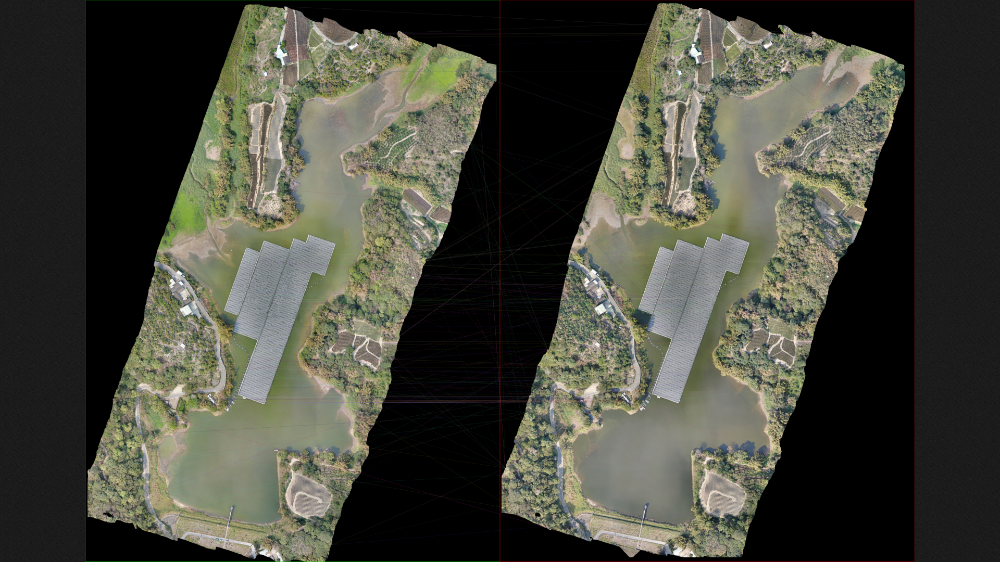
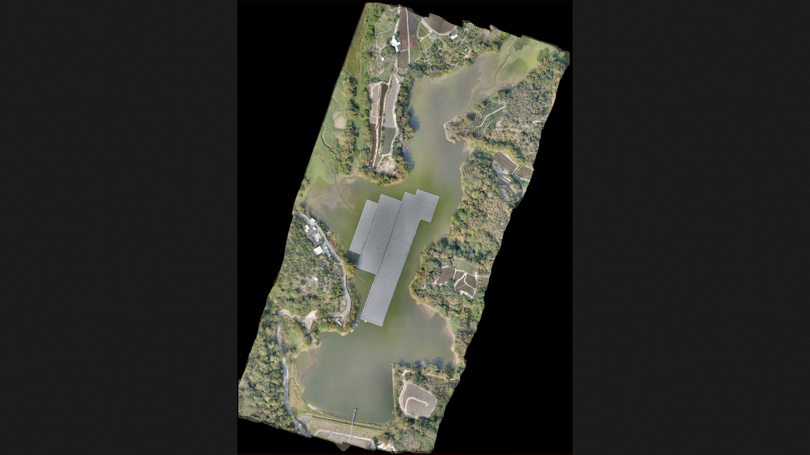
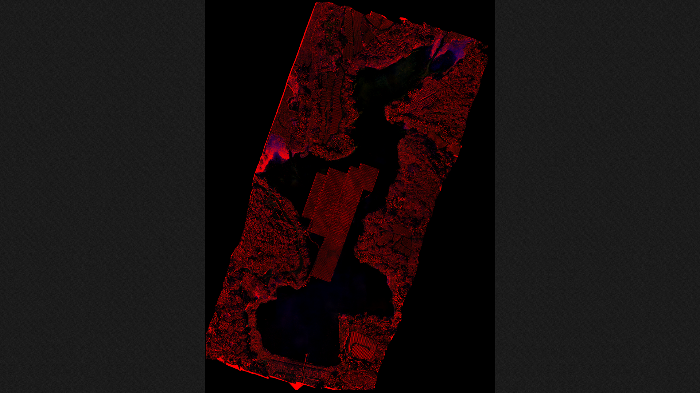
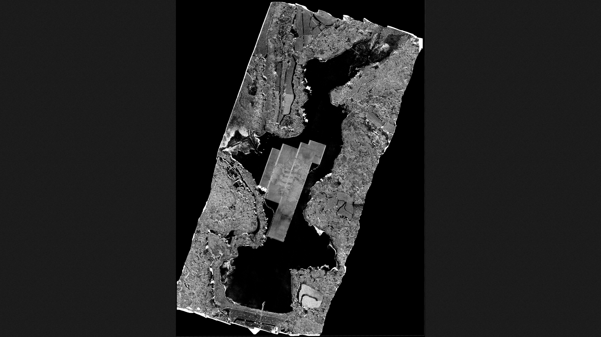

# image-align-comparison
Alignment two aerial photography photo and comparison them, find the difference by opencv.

Create your virtual environment and enable it:
```
virtualenv -p ~/.pyenv/versions/3.6.12/bin/python venv
. venv/bin/activate
pip install -r requirements.txt
```

Run:
```
python main.py <image1> <image2>
```

Result example:




